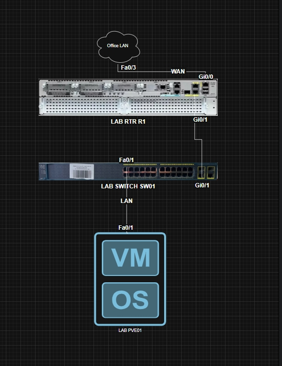

# HomeLab

Personal infrastructure laboratory built on real hardware.

The goal of this project is to gain hands-on experience with enterprise networking, virtualization, Linux administration, infrastructure automation and DevOps practices.

---

## Hardware

| Device           | Model                      |
| ---------------- | -------------------------- |
| Router           | Cisco 2921                 |
| Switch           | Cisco Catalyst 2960-24TC-S |
| Internet Gateway | TP-Link Router             |
| Hypervisor       | Proxmox VE (planned)       |

---

## Network Design

| VLAN | Name       | Subnet          |
| ---- | ---------- | --------------- |
| 10   | Management | 192.168.10.0/24 |
| 20   | Users      | 192.168.20.0/24 |
| 30   | DMZ        | 192.168.30.0/24 |
| 50   | Servers    | 192.168.50.0/24 |

---

## Implemented

* Router-on-a-Stick
* Inter-VLAN Routing
* VLAN Segmentation
* DHCP
* NAT (PAT)
* SSH Management
* Trunk Links
* Access Ports
* Management VLAN
* Internet Connectivity

---

## Planned

* Proxmox VE
* Ubuntu Server
* Docker
* TrueNAS
* Ansible
* Zabbix
* WireGuard VPN
* GitHub Actions
* Automated Cisco Configuration Backups

---

## Current Status

The physical network is fully operational.

Completed:

* Cisco 2921 configured
* Cisco 2960 configured
* VLANs operational
* DHCP operational
* NAT operational
* SSH access enabled
* Internet connectivity verified

Next Milestone:

* Install Proxmox VE
* Configure VLAN-aware Linux Bridge
* Deploy Ubuntu Server VM

---

## Repository Structure

homelab/
├── README.md
├── CHANGELOG.md
│
├── docs/
│   ├── network/
│   │   ├── ip-plan.md
│   │   └── topology.md
│   └── notes/
│
├── images/
│   ├── topology.png
│   └── rack.png
│
├── cisco/
│   ├── LAB-R1/
│   │   ├── running-config.cfg
│   │   └── startup-config.cfg
│   │
│   └── LAB-SW01/
│       ├── running-config.cfg
│       └── startup-config.cfg
│
├── proxmox/
├── docker/
├── ansible/
└── scripts/
---
## Laboratory Topology

## Project Goals

This repository documents the evolution of a real home lab built on enterprise hardware.

Every major configuration, topology change and service deployment is tracked using Git to document both the implementation process and infrastructure evolution.
